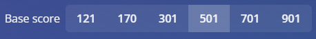

# Auto Autodarts

A simple Solution for an automated slot like dart machine. It is recommended to set it up on devices like a raspberry pi or other portable windows running devices.

It will start itself at the point the device is running and provide a locally hosted website acting like a remote control. The Point of this programm is to make it possible to create rounds with 1 click without having to move around to make you gaming experience a bit cleaner.

# Commands

```
[+, -] Eather one to add and remove a preset.

[gametype] The games are registred under the following names.

[gamename] To add remove named presets.
```

| Left                           |
| :----------------------------- |
| x01                            |
| cricket                        |
| bermuda                        |
| shanghai                       |
| gotcha                         |
| around **(around the world )** |
| round **(round the world)**    |
| random **(random checkout)**   |
| count **(count up)**           |
| segment **(segment training)** |
| bobs **(bobs 27)**             |

```
[0, NUMBER] Number to select the setting from top to buttom. 0 is using the default setting.
```



```
Example for adding a cricket round named cricket1 with all settings to set default except that lobby visibiliy is set to private:
+ cricket cricket1 0 0 0 0 0 2

Example for removing a round named cricket1:
- cricket1
```

# Setup

Install **[this](https://www.python.org/downloads/release/python-3132/)** version of python to guarantee it being able to run. And make sure to add **pip** in the Installer.
When installed run:

```
pip install -r [The Path to "requirements.txt" in this Projekt]
```

When no Erros accured create a shortcut to the "start.bat" File located in /src and put it in the windows autostart folder. And make sure to put no windows password.


